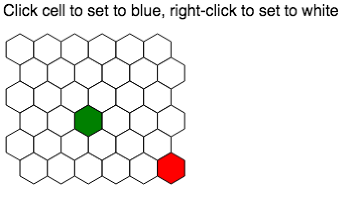

# @hex-engine/2d hexagon tile grid demo

This is an example repo showing how to create a grid of hexagon tiles in [Hex Engine](https://hex-engine.dev). The hexagon tiles change color when clicked on.

Big thanks to [this post by red blob games](https://www.redblobgames.com/grids/hexagons/) for a nice breakdown of how to model and draw hexagonal grids.



## Usage

To run a development webserver for your game locally:

```sh
npm start
```

To build a production version of your game for redistribution:

```sh
npm run build
```
